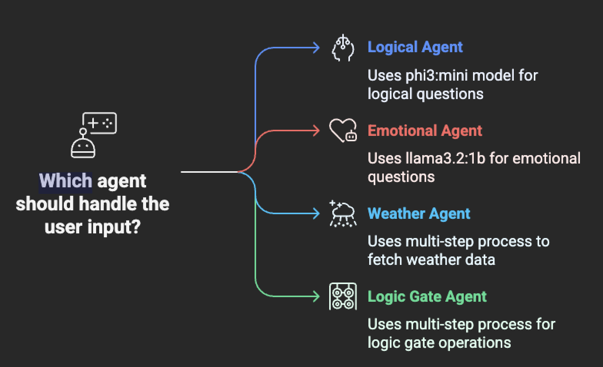
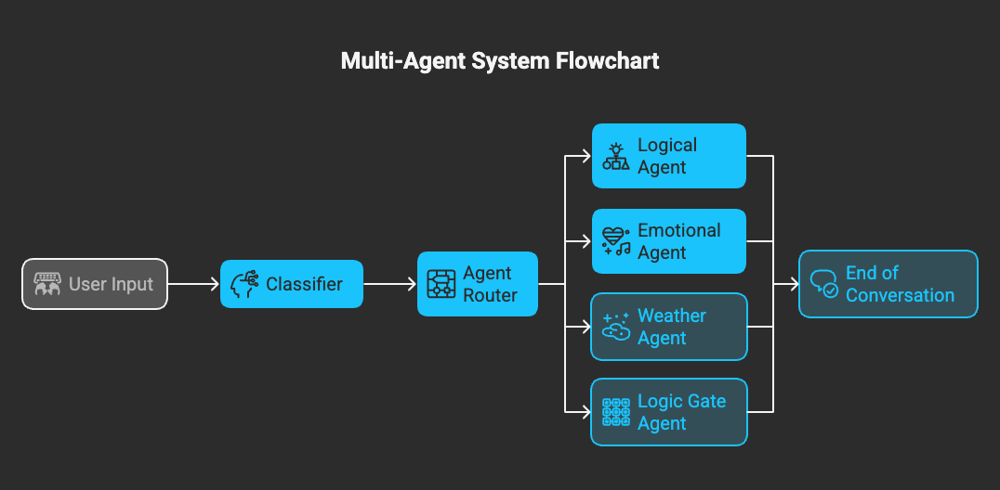
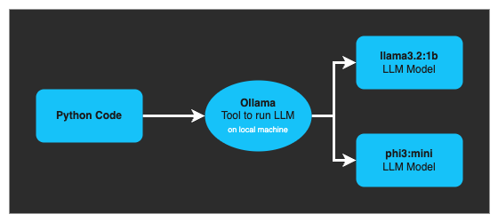
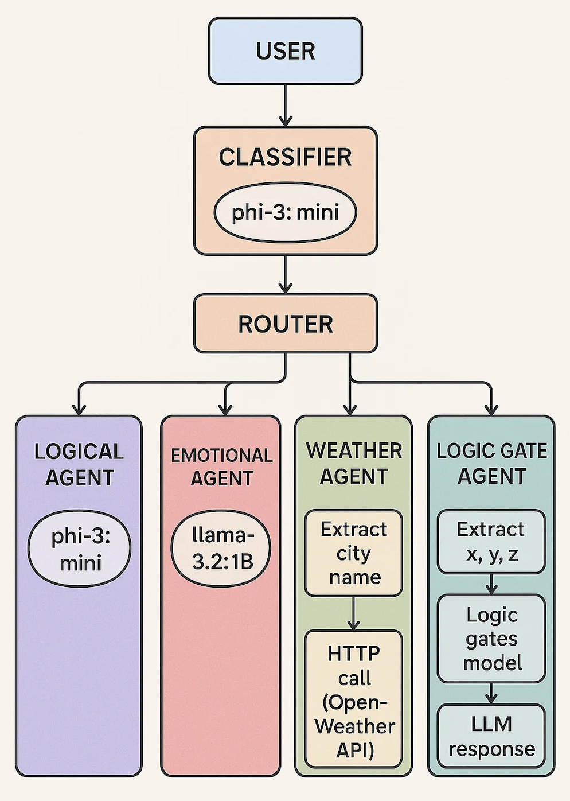

# Build Multi-Agent System with LangGraph

This LangGraph project implements a multi-agent system that takes user input and passes it to a classifier to determine which agent should handle the request. Once identified, the input is routed to the appropriate agent by a router component, which simply forwards the input to the selected agent.
## Goal
The goal of this project is to gain hands-on experience with building a Multi-Agent System. I consider it a "Hello World" project for exploring the core concepts of multi-agent architectures. The following areas are covered:

1. Running a Large Language Model (LLM) locally using Ollama.
2. Using multiple pre-trained LLMs (such as phi3:mini and llama3.2:1b) shared by the community.
3. Interacting with these models through Python code.
4. Leveraging LangGraph to construct a multi-agent workflow.
5. Implementing multiple agents to delegate tasks to the most relevant one for processing.
6. The focus is not on achieving high accuracy, but rather on gaining practical experience across different use cases.

## Tiers
### Ollama
We are using Ollama to run our Large Language Models (LLMs) locally. The models we’ll be working with are `llama3.2:1b` and `phi3:mini`.

    Ollama is not an LLM itself, but a tool that simplifies the process of running and managing LLMs on your local machine. It allows you to download, install, and run multiple models easily.

### 🧠 LLM (Large Language Model)
* These are advanced AI systems capable of understanding and generating human-like text.
* Examples include models from OpenAI, Google Gemma, Google Gemini, and Meta’s LLaMA series.
* Many high-quality open-source models are freely available and can be run locally using tools like Ollama.

### 💡 Application
An application, in this context, refers to any system or interface that accepts user input (or is triggered by an event) and interacts with an LLM to generate a response or perform a task.

For example, ChatGPT is a conversational AI chatbot developed by OpenAI, known for its ability to produce human-like responses and engage in dynamic conversations.

In our case, we will build a Python application that provides an interface to interact with LLMs locally using Ollama.

## 🧩 Nodes (Steps)

- **Classifier**  
  Uses an LLM to determine which agent is best suited to handle the user’s question based on its type.

- **Router**  
  A simple node responsible for forwarding the request to the appropriate agent based on the classified `message_type`.

- **Agents**  
  Intelligent components that process the input and generate a relevant response.

---

## 🤖 Agents

1. **Logical Agent** (`phi3:mini` LLM)  
   Handles logical or reasoning-based questions.

2. **Emotional Agent** (`llama3.2:1b` LLM)  
   Responds to questions related to the user’s emotional state.

3. **Weather Agent** (API Call)  
   - Uses `llama3.2:1b` LLM to extract the city name from the user's input.  
   - Makes an HTTP request to the **OpenWeather API** to fetch current weather data for that city.

4. **Logic Gate Agent** (Home-trained Model)  
   - A multi-step chained agent:
     1. Uses `llama3.2:1b` LLM to extract `x`, `y`, and `z` inputs from the user's message.  
     2. Passes these values to a home-trained neural network model based on **AND/OR gate logic**.  
     3. Uses the LLM again to convert the model's output into natural human-readable text.

5. **Fine-tuned Agent**  
   - **Not implemented yet** — would require more computational resources.

## Install Dependencies

### Install Ollama
Download Ollama from official site and run it (Its simple and straight forward step)

### Install Models
On Ollama site you can find a list of models, select that best suites you and download them by simple command.

`ollama pull llama3.2:1b`

`ollama pull phi3:mini`

### Install Python dependencies

`pip install -r requirements.txt`

## Updates
### Phase 1 - Two models
In phase one we added 2 agents emotional and logical using 2 different models

Refer Branch [phase1-two-agents](https://github.com/mazhar-hassan/ai-langgraph-ollama/tree/phase1-two-agents)

### Phase 2 - Conversation history
In order to have context for our conversation with our AI system, a memory of 20 messages added to the code

Refer Branch [phase2-conversation-history](https://github.com/mazhar-hassan/ai-langgraph-ollama/tree/phase2-conversation-history)

### Phase 3 - Weather checking Agent (Internet access)
In phase 3 we have defined a weather agent which extract city name from the conversation and make an http call to the internet (Weather APIs)
and format the response accordingly

Refer Branch [phase3-three-agents](https://github.com/mazhar-hassan/ai-langgraph-ollama/tree/phase3-three-agents)

