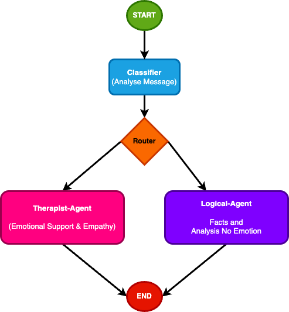
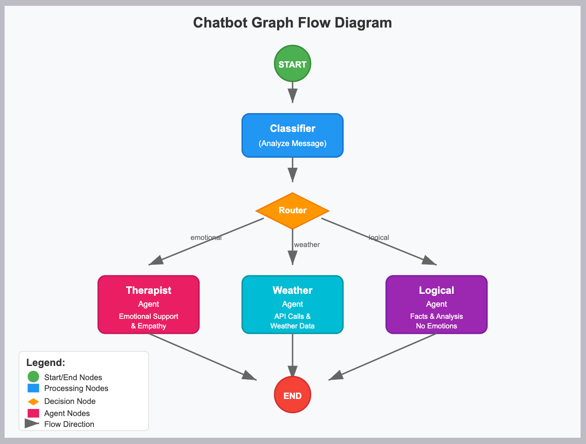

# LangGraph Tutorial

We are using Ollama as our LLM (to run on local machine) and the model we will be using is `llama3.2:1b`

> This is Multi Agent Hello-World code sample, all this information is learned from multiple tutorials.

In our system we will create 2 Agents, One for emotional support and the second one for Logical Reasoning, it is built this way to only showcase multi-agent.
Why they are same? because both are using same LLM which is not fine-tuned for Emotional support or Logical Reasoning (Its out of the scope of hello-world tutorial).

* **Classifier** It detects which Agent is suitable to answer the question
* **Router** It is a simple node which forward the request to correct agent based on the classified message_type
* **Agents** both agents are LLM use same model (`llama3.2:1b`)

> Read following before proceeding as this is hello-world tutorial for LangGraph
## Important Concepts
### LLM
* LLM is Large Language Model
* It is advanced AI systems that understand and generate human-like text 
* Examples: OpenAI, Google Gemma, Google Gemini, Meta Llama models etc

### Application
It could be any application that can provide interface for user input (or trigger point) which then interact with LLM

ChatGPT is a conversational AI chatbot developed by OpenAI, known for its ability to generate human-like text and engage in conversations

We will write out own application that will provide interface to use LLM

### Ollama
Ollama is a tool that simplifies running and managing large language models (LLMs) locally on your computer

    Ollama itself is not LLM but help in running LLM, you can run multipel LLM using Ollama (Download and install it)

### Models
There are multiple free models (LLMs) that you can download and run with the help of Ollama

`ollama pull llama3.2:1b`

In above example we are using llama3.2 LLM which is trained/support 1 billion parameters you can use its advanced version with more parameters, but obviously it will take more space and some impact on CPU as well.

### Our flow

`Python code` -> `ollama` -> `llama3.2`

## Install Dependencies

### Install Ollama
Download from official site and run it

### Install Models
On Ollama site you can find a list of models, select that best suites you and download them by simple command.

`ollama pull llama3.2:1b`

### Install Python dependencies

`pip install langchain-ollama langgraph pydantic python-dotenv`

## Updates
### Phase 1 - Two models
In phase one we added 2 models emotional and logical with history of 20 conversation

Refer Branch [phase1-two-agents](https://github.com/mazhar-hassan/ai-langgraph-ollama/tree/phase1-two-agents)

### Phase 2 - Conversation history
In order to have context for our conversation with our AI system, a memory of 20 messages added to the code

Refer Branch [phase2-conversation-history](https://github.com/mazhar-hassan/ai-langgraph-ollama/tree/phase2-conversation-history)

### Phase 3 - Weather checking Agent (Internet access)
In phase 3 we have defined a weather agent which extract city name from the conversation and make an http call to the internet (Weather APIs)
and format the response accordingly

Refer Branch [phase3-three-agents](https://github.com/mazhar-hassan/ai-langgraph-ollama/tree/phase3-three-agents)

